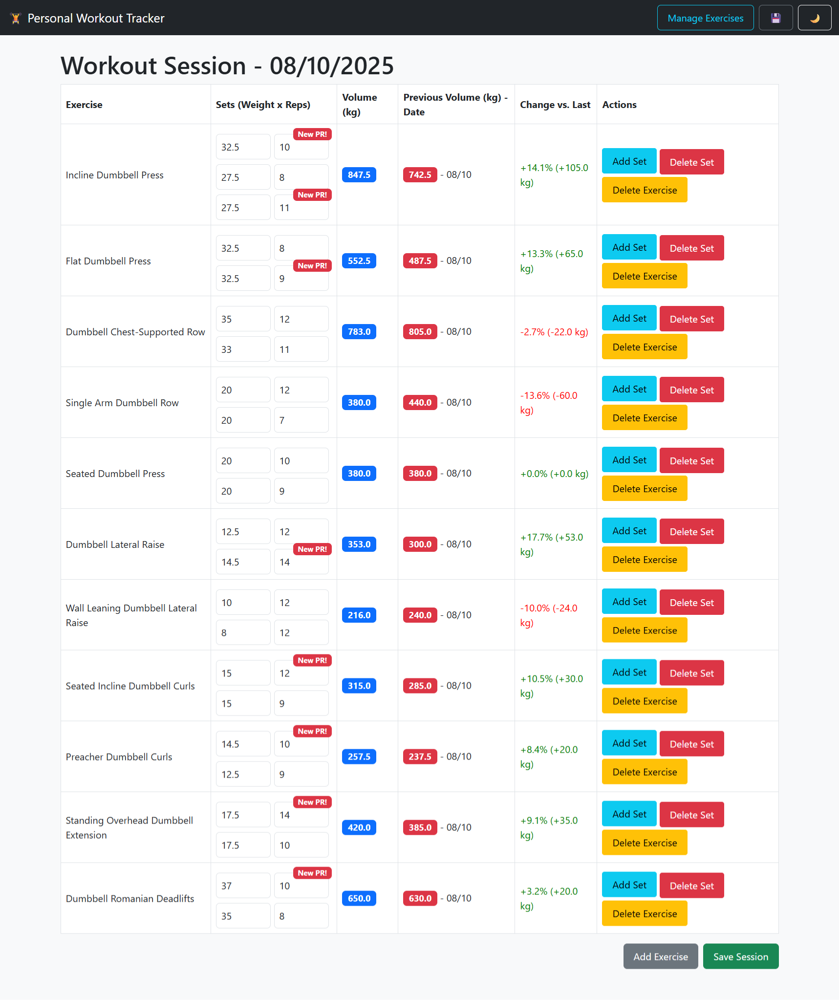
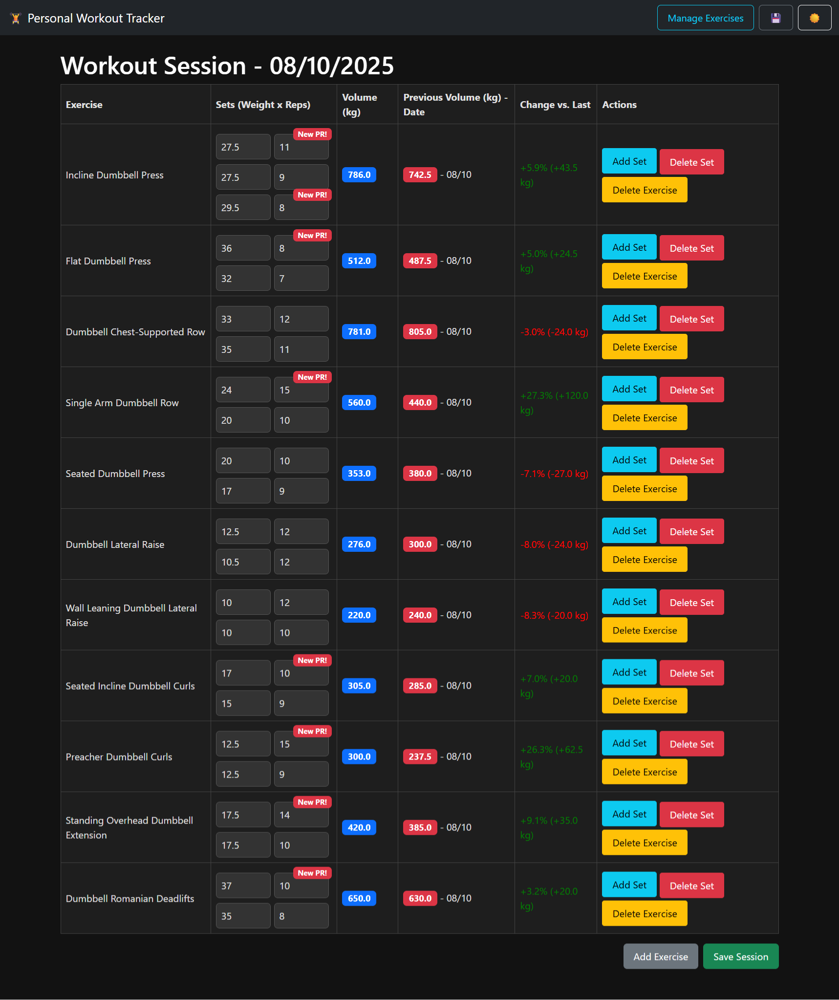

<p align="center">
  
</p>

<h1 align="center">🏋️ Personal Workout Tracker</h1>

<p align="center">
  <strong>Your ultimate companion for tracking gains, smashing goals, and building a stronger you.</strong>
  <br>
  A modern, feature-rich, single-page web application designed to help you track your workout progress with ease.
</p>

## ✨ Features

- **Interactive Workout Sessions:**
    - Start a new workout or edit any past session.
    - Automatically populates new sessions with the number of sets from your last performance of each exercise.
    - Previous weight and reps are shown as placeholders to encourage progressive overload.
    - Dynamically add or remove sets and exercises during a session.
- **Real-time Calculations:**
    - **Live Volume Tracking:** Total volume (Weight x Reps) is calculated and displayed instantly as you enter data.
    - **Performance Comparison:** See a real-time percentage and absolute volume change compared to the last time you performed an exercise.
    - **"New PR!" Alerts:** Get immediate feedback with a badge when you set a new personal record for weight or reps on any set.
- **Comprehensive Dashboard:**
    - **Workout Calendar:** A beautiful, interactive calendar view of your entire workout history. Click any marked day to view or edit that session.
    - **Motivational Stats:** At-a-glance badges for your current workout streak, plus totals for workouts this week, this month, and this year.
    - **Personal Records:** A scrollable list of your best lift (heaviest weight for reps) for every exercise you've performed.
- **Insightful Data Visualization:**
    - **Muscle Group Distribution:** A pie chart showing the percentage of your total volume dedicated to each muscle group (Chest, Back, etc.).
    - **Overall Volume Trend:** A line chart tracking your total workout volume over time.
    - **Exercise-Specific Progress:** A filterable line chart to track your volume progression for any individual exercise.
- **Customization & Usability:**
    - **Dark Mode:** A sleek dark theme that can be toggled on/off and is saved to your browser's preferences.
    - **Touch-Friendly & Responsive:** The entire application, including the complex workout table, is fully responsive and transforms into a user-friendly card layout on mobile devices.
- **Add New Exercises:** Easily expand your exercise library on the fly.
- **Data Portability:** Backup your entire workout history to a JSON file and restore it at any time.
- **PWA Ready:** Installable on your home screen for a full-screen, app-like experience on mobile devices.
- **Full Exercise Management:** A dedicated page to perform CRUD operations on all exercises and customize the default workout routine.

## 📸 Screenshots

Here's a look at the application in action.

| Light Mode | Dark Mode |
| :---: | :---: |
| **Main Dashboard** | **Main Dashboard** |
|  |  |
| **Workout Session** | **Workout Session** |
|  |  |
| **Workout Session (Mobile)** | **Workout Session (Mobile)** |
|  |  |
| **Manage Exercises** | **Backup & Restore** |
|  |  |
| **App Icon** | |
|  | |

## 🛠️ Tech Stack

- **Frontend:**
    - HTML5
    - CSS3
    - Vanilla JavaScript
- **Frameworks & Libraries:**
    - [Bootstrap 5](https://getbootstrap.com/) for responsive layout and components.
    - [FullCalendar](https://fullcalendar.io/) for the interactive workout calendar.
    - [Chart.js](https://www.chartjs.org/) for data visualization.
- **Backend:**
    - [Supabase](https://supabase.io/) for the PostgreSQL database and auto-generated APIs.

## 🚀 Setup and Installation

To get this project running on your local machine, follow these steps:

1.  **Clone the Repository (Optional):**
    ```bash
    git clone https://github.com/TomHuynhSG/personal-workout-tracker.git
    cd personal-workout-tracker
    ```

2.  **Set up Supabase:**
    - Go to [Supabase](https://supabase.io/) and create a new project.
    - Navigate to the **SQL Editor** in your new project.
    - Copy the entire content of the `setup.sql` script (provided below) and run it. This will create and configure all the necessary tables.

3.  **Configure Credentials:**
    - In your Supabase project, go to **Project Settings** > **API**.
    - Find your **Project URL** and **`anon` public API Key**.
    - Open the `supabaseClient.js` file in the project.
    - Paste your URL and Key into the `SUPABASE_URL` and `SUPABASE_KEY` constants, respectively.

4.  **Run the Application:**
    - Simply open the `index.html` file in your web browser. A live server extension for your code editor is recommended for the best experience.

5.  **(Optional) Add App Icons for PWA:**
    - For the "Add to Home Screen" feature to work correctly, create an `icons` folder in the root directory.
    - Inside the `icons` folder, place your app icons named `icon-192x192.png` and `icon-512x512.png`.

## 📄 `setup.sql`

Run this script in your Supabase SQL Editor to initialize the database.

```sql
-- Clear any existing workout data before inserting new samples
-- ===========================================================
-- 🧱 DATABASE INITIALIZATION
-- ===========================================================

-- Drop existing tables in reverse order of dependency
DROP TABLE IF EXISTS sets;
DROP TABLE IF EXISTS workout_sessions;
DROP TABLE IF EXISTS exercises;

-- -----------------------------------------------------------
-- Create the exercises table
-- -----------------------------------------------------------
CREATE TABLE exercises (
    id BIGINT PRIMARY KEY GENERATED ALWAYS AS IDENTITY,
    name TEXT NOT NULL UNIQUE,
    muscle_group TEXT NOT NULL,
    is_in_routine BOOLEAN DEFAULT TRUE NOT NULL,
    ordering INT,
    created_at TIMESTAMPTZ DEFAULT now() NOT NULL
);

-- -----------------------------------------------------------
-- Create the workout_sessions table
-- -----------------------------------------------------------
CREATE TABLE workout_sessions (
    id BIGINT PRIMARY KEY GENERATED ALWAYS AS IDENTITY,
    date DATE NOT NULL,
    created_at TIMESTAMPTZ DEFAULT now() NOT NULL
);

-- -----------------------------------------------------------
-- Create the sets table
-- -----------------------------------------------------------
CREATE TABLE sets (
    id BIGINT PRIMARY KEY GENERATED ALWAYS AS IDENTITY,
    workout_session_id BIGINT REFERENCES workout_sessions(id) ON DELETE CASCADE,
    exercise_id BIGINT REFERENCES exercises(id) ON DELETE CASCADE,
    set_number INT NOT NULL,
    weight NUMERIC,
    reps INT,
    volume NUMERIC GENERATED ALWAYS AS (weight * reps) STORED,
    created_at TIMESTAMPTZ DEFAULT now() NOT NULL
);

-- -----------------------------------------------------------
-- Insert initial exercises
-- -----------------------------------------------------------
INSERT INTO exercises (name, muscle_group, ordering) VALUES
('Incline Dumbbell Press', 'Chest', 1),
('Flat Dumbbell Press', 'Chest', 2),
('Dumbbell Chest-Supported Row', 'Back', 3),
('Single Arm Dumbbell Row', 'Back', 4),
('Seated Dumbbell Press', 'Shoulders', 5),
('Dumbbell Lateral Raise', 'Shoulders', 6),
('Wall Leaning Dumbbell Lateral Raise', 'Shoulders', 7),
('Seated Incline Dumbbell Curls', 'Arms', 8),
('Preacher Dumbbell Curls', 'Arms', 9),
('Standing Overhead Dumbbell Extension', 'Arms', 10),
('Dumbbell Romanian Deadlifts', 'Legs', 11);

```

## 🧪 Adding Sample Data (Optional)

To test the application's features with some realistic data, you can use the **Restore** feature on the "Backup / Restore" page to upload the sample data file located at `backup_data/workout-backup-sample.json`.

Alternatively, you can run the following SQL script in your Supabase SQL Editor. This will populate the database with three workout sessions showing progressive overload.

```sql
-- ===========================================================
-- 🧪 SAMPLE DATA (Chronological: 17d → 14d → 10d → 7d → 4d → 1d → Today)
-- ===========================================================

-- Clear prior data
DELETE FROM sets;
DELETE FROM workout_sessions;

-- -----------------------------------------------------------
-- SESSION 1 (17 Days Ago)
-- -----------------------------------------------------------
WITH s AS (
  INSERT INTO workout_sessions (date)
  VALUES (CURRENT_DATE - INTERVAL '17 day')
  RETURNING id
)
INSERT INTO sets (workout_session_id, exercise_id, set_number, weight, reps)
SELECT s.id, e.exercise_id, e.set_number, e.weight, e.reps
FROM (VALUES
(6, 5, 1, 12.5, 12), (6, 5, 2, 12.5, 11),
(6, 6, 1, 7.5, 15), (6, 6, 2, 7.5, 15),
(6, 8, 1, 7.5, 12), (6, 8, 2, 7.5, 12),
(6,11, 1, 20, 12), (6,11, 2, 20, 12)
) AS e(workout_id, exercise_id, set_number, weight, reps), s;

-- -----------------------------------------------------------
-- SESSION 2 (14 Days Ago)
-- -----------------------------------------------------------
WITH s AS (
  INSERT INTO workout_sessions (date)
  VALUES (CURRENT_DATE - INTERVAL '14 day')
  RETURNING id
)
INSERT INTO sets (workout_session_id, exercise_id, set_number, weight, reps)
SELECT s.id, e.exercise_id, e.set_number, e.weight, e.reps
FROM (VALUES
(5, 3, 1, 27.5, 12), (5, 3, 2, 27.5, 12),
(5, 4, 1, 12.5, 12), (5, 4, 2, 12.5, 12),
(5, 7, 1, 5, 15),    (5, 7, 2, 5, 15),
(5, 9, 1, 8, 12),    (5, 9, 2, 8, 10),
(5,10, 1, 10, 12),   (5,10, 2, 10, 12)
) AS e(workout_id, exercise_id, set_number, weight, reps), s;

-- -----------------------------------------------------------
-- SESSION 3 (10 Days Ago)
-- -----------------------------------------------------------
WITH s AS (
  INSERT INTO workout_sessions (date)
  VALUES (CURRENT_DATE - INTERVAL '10 day')
  RETURNING id
)
INSERT INTO sets (workout_session_id, exercise_id, set_number, weight, reps)
SELECT s.id, e.exercise_id, e.set_number, e.weight, e.reps
FROM (VALUES
(4, 1, 1, 17.5, 12), (4, 1, 2, 17.5, 11),
(4, 2, 1, 22.5, 10), (4, 2, 2, 22.5, 10),
(4, 3, 1, 25, 12),   (4, 3, 2, 25, 12),
(4, 5, 1, 12.5, 10), (4, 5, 2, 12.5, 10),
(4, 8, 1, 10, 10),   (4, 8, 2, 10, 8)
) AS e(workout_id, exercise_id, set_number, weight, reps), s;

-- -----------------------------------------------------------
-- SESSION 4 (7 Days Ago)
-- -----------------------------------------------------------
WITH s AS (
  INSERT INTO workout_sessions (date)
  VALUES (CURRENT_DATE - INTERVAL '7 day')
  RETURNING id
)
INSERT INTO sets (workout_session_id, exercise_id, set_number, weight, reps)
SELECT s.id, e.exercise_id, e.set_number, e.weight, e.reps
FROM (VALUES
(1, 1, 1, 20, 12),  (1, 1, 2, 20, 10), (1, 1, 3, 22.5, 8),
(1, 2, 1, 25, 10),  (1, 2, 2, 25, 9),
(1, 3, 1, 30, 12),  (1, 3, 2, 30, 11),
(1, 4, 1, 15, 12),  (1, 4, 2, 15, 12),
(1, 5, 1, 15, 10),  (1, 5, 2, 15, 9),
(1, 6, 1, 8, 15),   (1, 6, 2, 8, 14),
(1, 8, 1, 10, 12),  (1, 8, 2, 10, 11),
(1,10, 1, 12.5, 12),(1,10, 2, 12.5, 10),
(1,11, 1, 25, 12),  (1,11, 2, 25, 12)
) AS e(workout_id, exercise_id, set_number, weight, reps), s;

-- -----------------------------------------------------------
-- SESSION 5 (4 Days Ago)
-- -----------------------------------------------------------
WITH s AS (
  INSERT INTO workout_sessions (date)
  VALUES (CURRENT_DATE - INTERVAL '4 day')
  RETURNING id
)
INSERT INTO sets (workout_session_id, exercise_id, set_number, weight, reps)
SELECT s.id, e.exercise_id, e.set_number, e.weight, e.reps
FROM (VALUES
(2, 1, 1, 22.5, 10), (2, 1, 2, 22.5, 9), (2, 1, 3, 22.5, 8),
(2, 2, 1, 27.5, 8),  (2, 2, 2, 27.5, 7),
(2, 3, 1, 32.5, 10), (2, 3, 2, 32.5, 10),
(2, 4, 1, 17.5, 10), (2, 4, 2, 17.5, 10),
(2, 5, 1, 17.5, 8),  (2, 5, 2, 17.5, 8),
(2, 6, 1, 10, 12),   (2, 6, 2, 10, 11),
(2, 9, 1, 10, 10),   (2, 9, 2, 10, 9),
(2,10, 1, 15, 10),   (2,10, 2, 15, 9),
(2,11, 1, 27.5, 10), (2,11, 2, 27.5, 10)
) AS e(workout_id, exercise_id, set_number, weight, reps), s;

-- -----------------------------------------------------------
-- SESSION 6 (Yesterday)
-- -----------------------------------------------------------
WITH s AS (
  INSERT INTO workout_sessions (date)
  VALUES (CURRENT_DATE - INTERVAL '1 day')
  RETURNING id
)
INSERT INTO sets (workout_session_id, exercise_id, set_number, weight, reps)
SELECT s.id, e.exercise_id, e.set_number, e.weight, e.reps
FROM (VALUES
(3, 1, 1, 22.5, 12), (3, 1, 2, 22.5, 11), (3, 1, 3, 25, 8),
(3, 2, 1, 27.5, 10), (3, 2, 2, 30, 7),
(3, 3, 1, 32.5, 12), (3, 3, 2, 32.5, 11),
(3, 4, 1, 17.5, 12), (3, 4, 2, 17.5, 11),
(3, 5, 1, 17.5, 10), (3, 5, 2, 17.5, 9),
(3, 7, 1, 8, 12),    (3, 7, 2, 8, 12),
(3, 8, 1, 12.5, 10), (3, 8, 2, 12.5, 9),
(3,10, 1, 15, 12),   (3,10, 2, 15, 11),
(3,11, 1, 30, 10),   (3,11, 2, 30, 10)
) AS e(workout_id, exercise_id, set_number, weight, reps), s;

-- -----------------------------------------------------------
-- SESSION 7 (Today) — All Exercises Completed, PR/High Volume
-- -----------------------------------------------------------
-- Bump loads/reps beyond previous bests for a clear “record” day.
WITH s AS (
  INSERT INTO workout_sessions (date)
  VALUES (CURRENT_DATE)
  RETURNING id
)
INSERT INTO sets (workout_session_id, exercise_id, set_number, weight, reps)
SELECT s.id, e.exercise_id, e.set_number, e.weight, e.reps
FROM (VALUES
-- 1) Incline Dumbbell Press (Prev best load: 25; now 27.5)
(7, 1, 1, 27.5, 10), (7, 1, 2, 27.5, 9), (7, 1, 3, 27.5, 8),
-- 2) Flat Dumbbell Press (Prev best load: 30; now 32.5)
(7, 2, 1, 32.5, 8),  (7, 2, 2, 32.5, 7),
-- 3) Chest-Supported Row (Prev best: 32.5; now 35)
(7, 3, 1, 35, 12),   (7, 3, 2, 35, 11),
-- 4) Single Arm Row (Prev best: 17.5; now 20)
(7, 4, 1, 20, 12),   (7, 4, 2, 20, 10),
-- 5) Seated DB Press (Prev best: 17.5; now 20)
(7, 5, 1, 20, 10),   (7, 5, 2, 20, 9),
-- 6) Lateral Raise (Prev best: 10; now 12.5)
(7, 6, 1, 12.5, 12), (7, 6, 2, 12.5, 12),
-- 7) Wall-Leaning Lateral Raise (Prev best: 8; now 10)
(7, 7, 1, 10, 12),   (7, 7, 2, 10, 12),
-- 8) Seated Incline Curls (Prev best: 12.5; now 15)
(7, 8, 1, 15, 10),   (7, 8, 2, 15, 9),
-- 9) Preacher Curls (Prev best: 10; now 12.5)
(7, 9, 1, 12.5, 10), (7, 9, 2, 12.5, 9),
-- 10) Overhead DB Extension (Prev best: 15; now 17.5)
(7,10, 1, 17.5, 12), (7,10, 2, 17.5, 10),
-- 11) Dumbbell RDL (Prev best load: 30; now 35)
(7,11, 1, 35, 10),   (7,11, 2, 35, 8)
) AS e(workout_id, exercise_id, set_number, weight, reps), s;
```

## ✍️ Author

- **Huynh Nguyen Minh Thong (Tom Huynh)**

## 🏋️‍♂️ A Note from the Developer

This project was born from a personal need to track workouts in a minimalistic home gym setup, centered around adjustable dumbbells and a bench. That's why the initial exercises and sample data are all dumbbell-focused. The goal was to create a tool perfectly tailored to this efficient and effective style of training.


